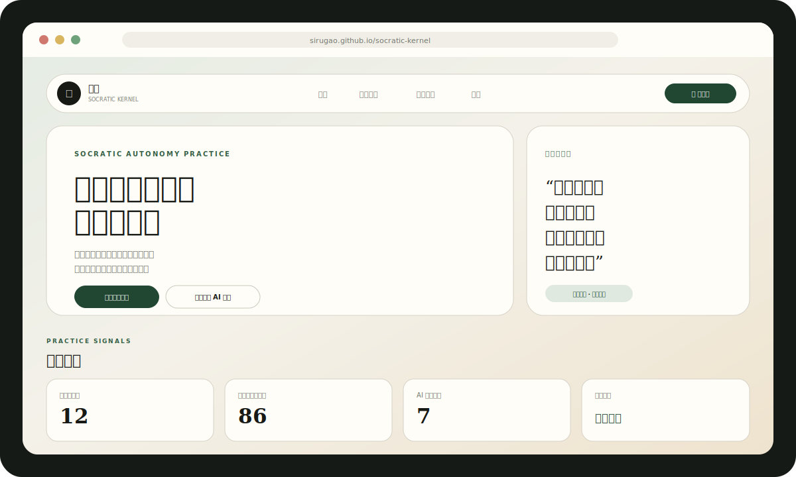
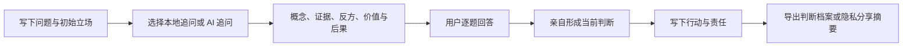

<div align="center">
  <a href="https://sirugao.github.io/socratic-kernel/">
    
  </a>

  <h1>Socratic Kernel · 内核</h1>

  <p><strong>一个不替你做决定的认知自主权练习应用。</strong></p>
  <p>先写下自己的立场，再审查前提、证据、反方、价值与责任。</p>

  <p>
    <a href="https://sirugao.github.io/socratic-kernel/"></a>
    <a href="https://vercel.com/new/clone?repository-url=https%3A%2F%2Fgithub.com%2FSiruGao%2Fsocratic-kernel&project-name=socratic-kernel&repository-name=socratic-kernel"></a>
  </p>

  <p>
    <a href="./docs/QUICKSTART.md">5 分钟开始</a>
    ·
    <a href="./docs/MODEL_CENTER.md">模型中心</a>
    ·
    <a href="./docs/AI_GATEWAY.md">接入大模型</a>
    ·
    <a href="./docs/PRODUCT.md">产品原则</a>
    ·
    <a href="./README_EN.md">English</a>
  </p>

  <p>
    <a href="https://github.com/SiruGao/socratic-kernel/actions/workflows/deploy-kernel-pages.yml"></a>
    <a href="https://github.com/SiruGao/socratic-kernel/stargazers"></a>
    <a href="https://github.com/SiruGao/socratic-kernel/commits/main"></a>
    
    
    
    
  </p>
</div>

> [!IMPORTANT]
> Socratic Kernel 不是更快的答案机器。它要求用户先形成初始立场，再接受结构化追问；最终判断、行动和责任必须由用户亲自确认。

<p align="center">
  
</p>

## 为什么需要它

生成式 AI 让答案变得即时、完整而廉价，也让问题定义、价值排序和最终判断更容易被一并外包。

Socratic Kernel 关心的不是“少用 AI”，而是重新划定认知分工：

| 普通 AI 助手 | Socratic Kernel |
| --- | --- |
| 尽快提供答案 | 先要求用户写下自己的立场 |
| 降低所有认知摩擦 | 只在价值判断和推理缺口处保留必要摩擦 |
| 优化满意度和对话时长 | 优化反例意识、独立核验和责任承担 |
| 记住偏好以提高便利 | 记录可导出、可否定、可删除的思考线索 |
| 可能强化既有叙事 | 主动检查证据、可证伪性和最强反方 |

## 核心体验



### 五种模式

| 模式 | 适用场景 | 主要检验 |
| --- | --- | --- |
| **决策审议** | 项目、工作、关系或行动选择 | 标准冲突、长期代价、可逆实验 |
| **观点审查** | 检查一个自己确信的主张 | 证据、可证伪性、最强反方 |
| **阅读质疑** | 分析文章、网页、报告或他人论证 | 隐藏前提、框架遗漏、引用责任 |
| **自我反思** | 理解欲望、焦虑与重复行为模式 | 欲望来源、身份压力、现实验证 |
| **AI 使用审计** | 在向 AI 外包任务或判断之前 | 认知分工、接受条件、独立核验 |

## v0.6 当前能力

- 本地优先的五种结构化审议模式；
- 首次访问引导与可编辑示例；
- 离线规则引擎，无需账号或服务器；
- 可选多供应商 Gateway：OpenAI、Claude、Gemini、DeepSeek、Qwen、Kimi、Grok；
- 清晰的模型中心：连接 Gateway、选择模型、真实调用测试；
- AI 失败自动回退本地问题，不中断审议；
- 审议前后确信程度对比；
- 艺术化判断卡：结论、最强反方、行动、责任与确信变化；
- Markdown、纯文本和单条 JSON 私密导出；
- 默认去隐私的公开分享摘要；
- 七天复查提示；
- 长期思考档案、完整 JSON 备份与删除；
- PWA 安装、离线缓存、移动端和减少动态效果支持；
- Pull Request 自动测试和构建。

## 5 分钟开始

### 直接体验

打开 **[GitHub Pages 本地版](https://sirugao.github.io/socratic-kernel/)**。它提供完整本地审议、档案、结果卡和 PWA，不调用大模型。

### 本地运行

```bash
git clone https://github.com/SiruGao/socratic-kernel.git
cd socratic-kernel
python3 -m http.server 4173
```

打开 `http://localhost:4173`。

### 启用真实 AI

点击 README 顶部的 **Deploy with Vercel**，或手动导入仓库。随后在 Vercel 环境变量中配置至少一个供应商密钥：

```bash
OPENAI_API_KEY=your_server_side_key
OPENAI_MODEL=gpt-5-mini
AI_GATEWAY_TOKEN=your_private_beta_token
```

重新部署后，在应用的“模型”页面依次完成：

```text
检查 Gateway → 选择默认模型 → 测试模型 → 启用 AI 追问
```

完整说明见 [`docs/QUICKSTART.md`](./docs/QUICKSTART.md) 与 [`docs/AI_GATEWAY.md`](./docs/AI_GATEWAY.md)。

## 隐私边界

不开启 AI 时，问题、回答和档案只保存在当前浏览器。

开启 AI 时，只发送本次审议所需的最小字段：模式、问题、初始立场、依据、确信度和挑战强度。

- 供应商 API Key 只存在于服务端；
- 默认不发送历史档案、其他回答和长期模式统计；
- 公开分享默认不包含问题正文、当前判断或行动；
- 所有本地数据都可以导出或删除；
- 不进行广告画像，不把认知线索描述为心理诊断。

## 技术架构

```text
Web / PWA
├── 本地规则引擎
├── 本地思考档案
├── 判断结果与隐私分享
└── 可选 AI 客户端
          ↓
Socratic Kernel Gateway (Vercel Serverless)
          ↓
OpenAI / Claude / Gemini / DeepSeek / Qwen / Kimi / Grok
```

| 层 | 实现 | 职责 |
| --- | --- | --- |
| 应用与审议 | `app.js` | 状态、规则问题、流程与档案 |
| 首次体验 | `onboarding.js` | 引导和示例 |
| 模型中心 | `ai.js` | Gateway、供应商、测试与回退 |
| 判断结果 | `results.js` | 判断卡、私密导出和隐私分享 |
| 视觉与交互 | `styles.css`、`motion.css` 等 | 编辑式界面、响应式与动效降级 |
| 服务端网关 | `api/`、`lib/ai-gateway.js` | 密钥、供应商适配和结构化输出 |
| 离线能力 | `manifest.webmanifest`、`sw.js` | PWA 与静态资源缓存 |
| 质量门禁 | Node tests + GitHub Actions | 语法、隐私边界、网关和构建验证 |

## 路线图

- [x] 本地优先审议闭环
- [x] 多供应商模型网关与模型中心
- [x] 判断卡、私密导出与隐私分享
- [x] PWA、离线与艺术化界面
- [ ] 浏览器扩展：选中文字后启动阅读质疑
- [ ] 账号、额度、限流和成本控制
- [ ] 独立的反迎合审查器
- [ ] Tauri 桌面端与 Capacitor 移动端
- [ ] 可追溯哲学知识层
- [ ] 用户可编辑的个人认知模型
- [ ] 独立性效果研究

详细计划见 [`docs/ROADMAP.md`](./docs/ROADMAP.md)。

## 参与贡献

我们欢迎代码，也欢迎问题设计、文档、翻译、无障碍、隐私威胁模型和研究评估。

从这里开始：

- 阅读 [`CONTRIBUTING.md`](./CONTRIBUTING.md)；
- 查看 [开放 Issues](https://github.com/SiruGao/socratic-kernel/issues)；
- 提交 [Feature Request](https://github.com/SiruGao/socratic-kernel/issues/new?template=feature_request.yml)；
- 安全问题使用 [Private Vulnerability Reporting](https://github.com/SiruGao/socratic-kernel/security/advisories/new)。

如果这个方向值得继续，请 Star 仓库。Star 不代表认同每个设计决定，而是让更多愿意讨论“AI 与判断自主权”的人看到它。

## 文档

| 文档 | 内容 |
| --- | --- |
| [`QUICKSTART.md`](./docs/QUICKSTART.md) | 本地版与 AI 版快速开始 |
| [`PRODUCT.md`](./docs/PRODUCT.md) | 产品使命、原则和边界 |
| [`MODEL_CENTER.md`](./docs/MODEL_CENTER.md) | Gateway、供应商、模型和测试逻辑 |
| [`AI_GATEWAY.md`](./docs/AI_GATEWAY.md) | 七家供应商与服务端配置 |
| [`ARCHITECTURE.md`](./docs/ARCHITECTURE.md) | 当前与未来架构 |
| [`VISUAL_SYSTEM.md`](./docs/VISUAL_SYSTEM.md) | 品牌与交互设计系统 |
| [`GROWTH.md`](./docs/GROWTH.md) | 订阅、留存和发布原则 |
| [`LAUNCH.md`](./docs/LAUNCH.md) | 公开发布和社区增长计划 |
| [`SECURITY.md`](./SECURITY.md) | 隐私与安全报告 |

## 产品边界

Socratic Kernel 不是心理治疗工具，也不替代医疗、法律、财务或其他专业意见。它不会因为识别到某种语言模式，就断言用户具有某种人格或心理状态。所有“线索”都只是需要继续核验的假设。

## License

[MIT License](./LICENSE)

---

<div align="center">
  <strong>一个好的 AI 苏格拉底，不应让人永久依赖它。</strong><br />
  它的目标，是让用户逐渐能够在没有它时继续追问、判断与承担。
</div>
