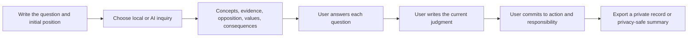

<div align="center">
  <a href="https://sirugao.github.io/socratic-kernel/">
    
  </a>

  <h1>Socratic Kernel</h1>
  <p><strong>A local-first application for practicing cognitive autonomy.</strong></p>
  <p>Write your position first, then examine assumptions, evidence, opposition, values, consequences, and responsibility.</p>

  <p>
    <a href="https://sirugao.github.io/socratic-kernel/"></a>
    <a href="https://vercel.com/new/clone?repository-url=https%3A%2F%2Fgithub.com%2FSiruGao%2Fsocratic-kernel&project-name=socratic-kernel&repository-name=socratic-kernel"></a>
  </p>

  <p>
    <a href="./docs/QUICKSTART.md">5-minute quickstart</a>
    ·
    <a href="./docs/MODEL_CENTER.md">Model center</a>
    ·
    <a href="./docs/AI_GATEWAY.md">AI Gateway</a>
    ·
    <a href="./docs/PRODUCT.md">Product principles</a>
    ·
    <a href="./README.md">简体中文</a>
  </p>

  <p>
    <a href="https://github.com/SiruGao/socratic-kernel/actions/workflows/deploy-kernel-pages.yml"></a>
    <a href="https://github.com/SiruGao/socratic-kernel/stargazers"></a>
    
    
    
    
  </p>
</div>

> [!IMPORTANT]
> Socratic Kernel is not a faster answer machine. It requires an initial human position before structured inquiry. The user must still confirm the final judgment, action, and responsibility.

<p align="center">
  
</p>

## Why it exists

Generative AI makes answers immediate, polished, and inexpensive. It can also make problem framing, value prioritization, and final judgment easy to outsource.

Socratic Kernel is not anti-AI. It redraws the cognitive division of labor:

| Conventional AI assistant | Socratic Kernel |
| --- | --- |
| Produces an answer quickly | Requires an initial human position first |
| Removes cognitive friction | Preserves friction around reasoning and value judgments |
| Optimizes satisfaction and engagement | Optimizes counterexample awareness, verification, and responsibility |
| Learns preferences for convenience | Keeps an inspectable, exportable, deletable reasoning record |
| May reinforce an existing narrative | Tests evidence, falsifiability, and the strongest opposing view |

## Core experience



## Five inquiry modes

| Mode | Best for | Main examination |
| --- | --- | --- |
| **Decision inquiry** | Choosing a project, job, relationship, or direction | Criteria conflicts, long-term costs, reversible experiments |
| **Belief audit** | Examining a strongly held claim | Evidence, falsifiability, strongest opposition |
| **Reading inquiry** | Analyzing an article, webpage, report, or argument | Hidden assumptions, omitted frames, citation responsibility |
| **Self-reflection** | Understanding motives, anxiety, and repeated behavior | Sources of desire, identity pressure, reality testing |
| **AI-use audit** | Before delegating work or judgment to AI | Cognitive division of labor, acceptance criteria, independent verification |

## What v0.6 includes

- Five local-first structured inquiry modes;
- First-run guidance and editable examples;
- Offline rule engine with no account or server requirement;
- Optional multi-provider Gateway for OpenAI, Claude, Gemini, DeepSeek, Qwen, Kimi, and Grok;
- Guided model center with Gateway checks, provider selection, and real model testing;
- Automatic local fallback when a provider fails;
- Before/after confidence comparison;
- Collectible judgment artifact with conclusion, strongest opposition, action, responsibility, and confidence shift;
- Private Markdown, plain-text, and single-session JSON exports;
- Privacy-safe public sharing with explicit opt-in fields;
- Seven-day judgment review prompt;
- Local archive, full backup, import, and deletion;
- Installable offline PWA, responsive design, and reduced-motion support;
- Automated Pull Request checks and static builds.

## 5-minute start

### Use the local version

Open **[sirugao.github.io/socratic-kernel](https://sirugao.github.io/socratic-kernel/)**. It includes the full local inquiry experience, archive, judgment artifact, and PWA without calling an LLM.

### Run locally

```bash
git clone https://github.com/SiruGao/socratic-kernel.git
cd socratic-kernel
python3 -m http.server 4173
```

Then open `http://localhost:4173`.

### Enable real AI models

Use the **Deploy AI Version** button above or import the repository into Vercel. Configure at least one provider in Vercel environment variables:

```bash
OPENAI_API_KEY=your_server_side_key
OPENAI_MODEL=gpt-5-mini
AI_GATEWAY_TOKEN=your_private_beta_token
```

Redeploy, then open the Model Center:

```text
Check Gateway → select a provider → test the model → enable AI inquiry
```

See [`docs/QUICKSTART.md`](./docs/QUICKSTART.md) and [`docs/AI_GATEWAY.md`](./docs/AI_GATEWAY.md).

## Privacy by architecture

Without AI enabled, questions, answers, and archives remain in browser storage.

With AI enabled, the application sends only the current mode, question, initial position, evidence, confidence, and challenge level.

- Provider API keys remain server-side;
- Historical archives and other answers are not sent by default;
- Public sharing excludes the question, judgment, and action by default;
- Local data can be exported or deleted;
- No advertising profile is created;
- Reasoning signals are hypotheses for examination, not mental-health diagnoses.

## Architecture

```text
Web / PWA
├── local rule engine
├── local reasoning archive
├── judgment artifact and privacy-safe sharing
└── optional AI client
          ↓
Socratic Kernel Gateway (Vercel Serverless)
          ↓
OpenAI / Claude / Gemini / DeepSeek / Qwen / Kimi / Grok
```

## Roadmap

- [x] Local-first structured inquiry loop
- [x] Multi-provider Gateway and model center
- [x] Judgment artifact, private exports, and privacy-safe sharing
- [x] Installable offline PWA and original editorial interface
- [ ] Browser extension for inquiry from selected webpage text
- [ ] Accounts, quotas, rate limits, and cost controls
- [ ] Independent anti-sycophancy reviewer
- [ ] Tauri desktop and Capacitor mobile applications
- [ ] Traceable philosophy source layer
- [ ] User-editable cognitive model
- [ ] Longitudinal autonomy evaluation

## Contributing

Code is welcome, but so are inquiry protocols, documentation, translation, accessibility work, privacy threat modeling, and evaluation research.

Start with:

- [`CONTRIBUTING.md`](./CONTRIBUTING.md)
- [open issues](https://github.com/SiruGao/socratic-kernel/issues)
- [feature request form](https://github.com/SiruGao/socratic-kernel/issues/new?template=feature_request.yml)
- [private vulnerability reporting](https://github.com/SiruGao/socratic-kernel/security/advisories/new)

If protecting human judgment in the age of AI is a direction worth continuing, consider starring the repository so more people can find and challenge the idea.

## Boundaries

Socratic Kernel is not therapy and does not replace medical, legal, financial, or other professional advice. A detected pattern is a hypothesis for examination, not a diagnosis.

## License

[MIT License](./LICENSE)

---

<div align="center">
  <strong>A good AI Socrates should not make people permanently dependent on it.</strong><br />
  It should help them continue questioning, judging, and taking responsibility without it.
</div>
