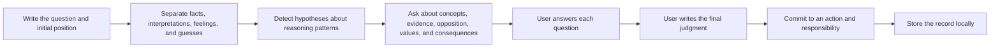

<div align="center">
  <a href="https://sirugao.github.io/socratic-kernel/">
    
  </a>

  <h1>Socratic Kernel</h1>
  <p><strong>A local-first practice tool for cognitive autonomy.</strong></p>
  <p>Write your position first, then examine assumptions, evidence, counterarguments, values, and responsibility.</p>

  <p>
    <a href="https://sirugao.github.io/socratic-kernel/"><strong>Live Demo</strong></a>
    ·
    <a href="./docs/PRODUCT.md">Product Principles</a>
    ·
    <a href="./docs/ROADMAP.md">Roadmap</a>
    ·
    <a href="./README.md">简体中文</a>
  </p>

  <p>
    <a href="https://github.com/SiruGao/socratic-kernel/actions/workflows/deploy-kernel-pages.yml"></a>
    <a href="https://github.com/SiruGao/socratic-kernel/stargazers"></a>
    
    
    
    
  </p>
</div>

> [!IMPORTANT]
> **This is an early MVP.** It uses transparent local rules and structured inquiry. It does not call a cloud LLM and does not claim to diagnose personality or mental health conditions.

<p align="center">
  
</p>

## Why it exists

Generative AI makes answers immediate, polished, and inexpensive. It can also make it easy to outsource problem framing, value prioritization, and final judgment.

Socratic Kernel is not anti-AI. It asks:

- Which tasks should be delegated to tools?
- Which judgments should remain human?
- Are we confusing fluent language with sufficient evidence?
- Does responsibility return to the user when the interaction ends?

| Conventional AI assistant | Socratic Kernel |
| --- | --- |
| Produces an answer quickly | Requires an initial human position first |
| Removes cognitive friction | Introduces friction only around reasoning and value judgments |
| Optimizes satisfaction and engagement | Optimizes independent judgment and responsibility |
| Learns preferences for convenience | Keeps an inspectable, exportable, deletable reasoning record |
| May reinforce an existing narrative | Tests confirmation bias, fluency trust, and judgment outsourcing |

## How it works



## Five inquiry modes

| Mode | Best for | Main examination |
| --- | --- | --- |
| **Decision inquiry** | Choosing a project, job, relationship, or direction | Criteria conflicts, long-term costs, reversible experiments |
| **Belief audit** | Examining a strongly held claim | Evidence, falsifiability, strongest opposition |
| **Reading inquiry** | Analyzing an article, webpage, report, or argument | Hidden assumptions, omitted frames, citation responsibility |
| **Self-reflection** | Understanding motives, anxiety, and repeated behavior | Sources of desire, identity pressure, reality testing |
| **AI-use audit** | Before delegating work or judgment to AI | Cognitive division of labor, acceptance criteria, independent verification |

## Privacy by architecture

The current version has no backend. Inquiry data stays in browser `LocalStorage` by default.

- No upload of questions, answers, or reasoning records;
- No advertising trackers or analytics SDKs;
- Full JSON export and import;
- Per-record deletion and complete deletion;
- Inspectable front-end rules and scoring logic.

## Quick start

### Use online

Open **[sirugao.github.io/socratic-kernel](https://sirugao.github.io/socratic-kernel/)**.

### Run locally

```bash
git clone https://github.com/SiruGao/socratic-kernel.git
cd socratic-kernel
python3 -m http.server 4173
```

Then open `http://localhost:4173`.

### Test and build

```bash
npm test
npm run build
```

The static build is written to `dist/`.

## Architecture

The MVP deliberately uses zero frameworks, zero runtime dependencies, and no backend.

| Layer | Implementation | Responsibility |
| --- | --- | --- |
| Interface | `index.html` + `styles.css` | Responsive and accessible UI |
| Inquiry engine | `app.js` | State, pattern hypotheses, question composition, workflow |
| Local memory | `LocalStorage` | Inquiries, confidence changes, recurring signals |
| Offline | Web manifest + service worker | Installable PWA and caching |
| Quality gate | Node smoke tests + GitHub Actions | Syntax, capabilities, and deployment validation |

See [`docs/ARCHITECTURE.md`](./docs/ARCHITECTURE.md) for details.

## Roadmap

- [x] Local-first structured inquiry loop
- [x] AI-use audit
- [x] Local reasoning record, import/export, and deletion
- [x] Installable offline PWA
- [ ] Chrome, Edge, and Firefox extension
- [ ] Inquiry from selected webpage text
- [ ] Replaceable LLM inquiry layer
- [ ] Independent anti-sycophancy reviewer
- [ ] Traceable philosophy source layer
- [ ] User-editable cognitive model
- [ ] Longitudinal autonomy metrics and evaluation

See the full [`ROADMAP.md`](./docs/ROADMAP.md).

## Contributing

Contributions are especially welcome in inquiry protocols, anti-sycophancy evaluation, accessibility, browser extensions, privacy threat modeling, and methods for measuring independent judgment.

Read [`CONTRIBUTING.md`](./CONTRIBUTING.md) before starting substantial work.

## Boundaries

Socratic Kernel is not therapy and does not replace medical, legal, financial, or other professional advice. A detected pattern is a hypothesis for examination, not a diagnosis.

## License

MIT License. See [`LICENSE`](./LICENSE).

---

<div align="center">
  <strong>A good AI Socrates should not make people permanently dependent on it.</strong><br />
  It should help them continue questioning, judging, and taking responsibility without it.
</div>
